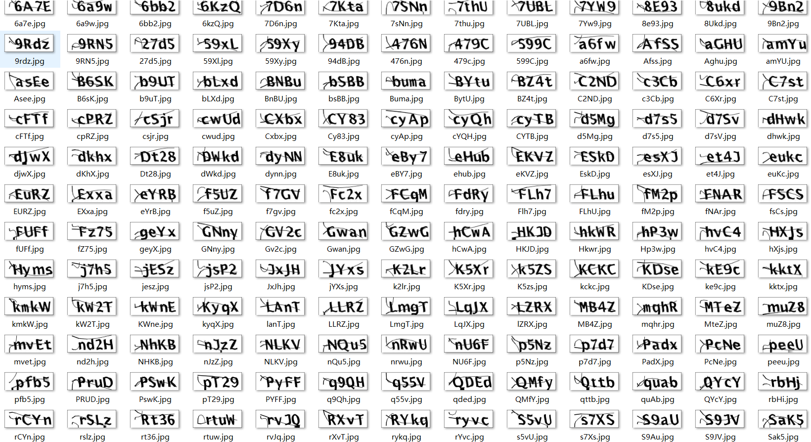
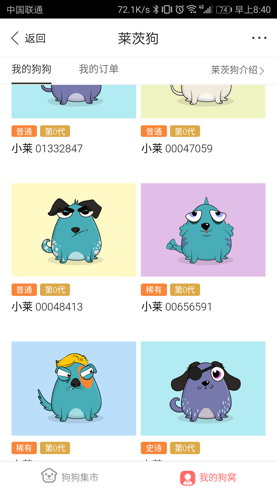

# 百度莱茨狗刷狗外挂

---

本外挂带有验证码识别功能

本项目基于[该项目](https://github.com/yanwii/pet-chain)开发，感谢原作者。

## 使用方法

__使用前请先更新`client.py`里面的token__

使用时，请先登陆百度账号，用chrome等浏览器打开莱茨狗市场页面，在`F12`开发者模式下点击按价格排序，右键`queryPetsOnSale`复制`request headers`，粘贴到`data/headers.txt`里。

在`config.ini`里修改购买策略，设置每一种狗狗的最大购买价格

```
[Pet-Chain]
interval    程序间隔
common      普通品质价格
rare        稀有品质价格
excellence  卓越品质价格
epic        史诗品质价格
mythical    神话品质价格
webdriver   firefox/chrome
```

本程序的验证码识别需要请求服务器API，我会不定期在这里发布免费token。

使用时，将`client.py`里的token字符串替换为下面列出的可用token即可。

如果需要查看验证码识别效果，可以将`pet_chain.py`里面将图片写入文件的代码注释去掉，验证码就会保存到`ocr_result`目录下（写入文件会拖慢速度，因此默认不保存验证码图片）。

## 交流

技术及token交流可加QQ，token可购买

QQ 3313266235

## 免费token

第一枚(用完再放新的)

- `asdfarhaer` 500次ocr

_右上角`Star`本项目，可QQ联系凭GitHub账号领取200次免费token_

## 验证码识别效果




